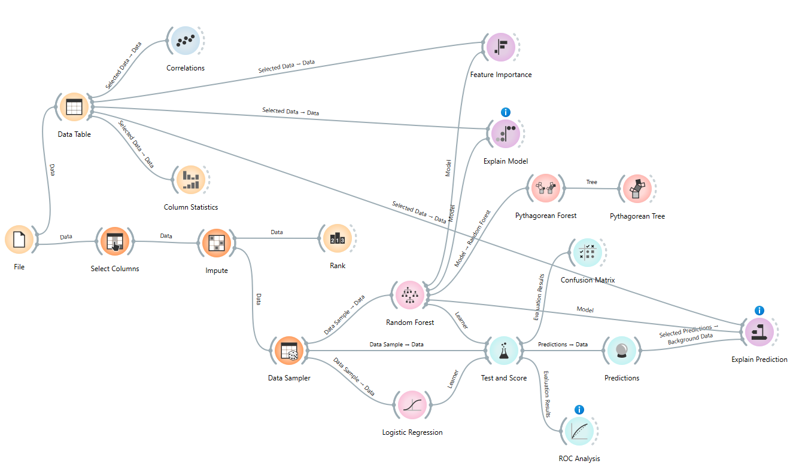

# Patient Heart Disease Risk Classification Model

A no-code machine learning project built in **Orange Data Mining** that classifies patients as high-risk or low-risk for heart disease.

## Overview

This project trains and compares two classification models — **Random Forest** and **Logistic Regression** — to predict heart disease risk from patient health data. The workflow is built entirely in Orange's visual, no-code environment.

**Best model:** Random Forest
| Metric | Score |
|---|---|
| AUC | 0.999 |
| F1 | 0.987 |
| Precision | 0.987 |
| Recall | 0.987 |

## The Workflow

The pipeline:
1. **File → Select Columns → Impute → Rank** – load and clean the data, select relevant features, impute missing values, and rank features.
2. **Data Table → Correlations / Column Statistics** – exploratory data analysis.
3. **Data Sampler → Random Forest / Logistic Regression → Test and Score** – train and evaluate both models.
4. **Confusion Matrix / ROC Analysis** – compare model performance.
5. **Feature Importance / Explain Model / Explain Prediction (Pythagorean Forest & Tree)** – SHAP-based interpretability.
6. **Predictions** – generate final classifications.

To explore or modify the workflow, open `workflow/patient_heart_disease_risk_model_IS7085.ows` in [Orange Data Mining](https://orangedatamining.com/) (free, open-source).

## Dataset

- **Source:** Kaggle: (https://www.kaggle.com/datasets/johnsmith88/heart-disease-dataset
- **Size:** 1,025 patient records, 13 predictor variables
- **Target:** Binary label — high risk (1) vs. low risk (0) of heart disease
- **Features include:** age, sex, chest pain type (`cp`), resting blood pressure (`trestbps`), cholesterol (`chol`), fasting blood sugar (`fbs`), resting ECG (`restecg`), max heart rate (`thalach`), exercise-induced angina (`exang`), ST depression (`oldpeak`), slope, number of major vessels (`ca`), and thalassemia test result (`thal`)

## Explainability

SHAP values were used to interpret model predictions. The top three most influential features were consistent across both feature importance and model explainability analyses:
- **thal** – thalassemia test result
- **ca** – number of major vessels colored by fluoroscopy
- **cp** – chest pain type

These align with established clinical risk indicators for heart disease, supporting the model's fairness and clinical plausibility.

## Tools Used

- [Orange Data Mining](https://orangedatamining.com/) — no-code visual ML platform
- SHAP — model explainability

## Author

Jay Weil

M.S. Business Analytics
B.S. Electrical Engineering
University of Cincinnati
